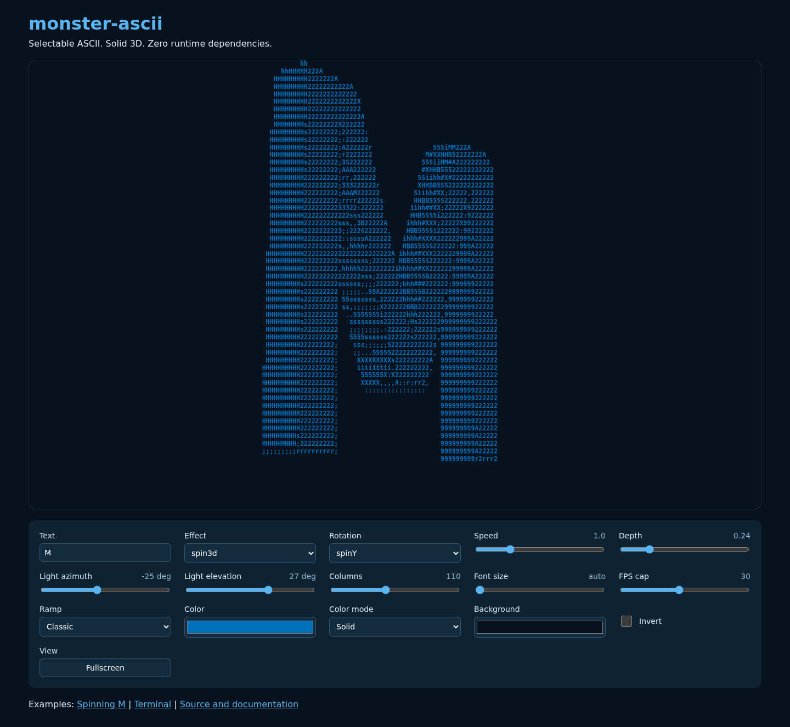

# monster-ascii

MIT licensed animated ASCII logos for browsers and terminals. Plain JavaScript ES modules, no build step and no runtime dependencies. SVG and PNG become selectable character grids. The 3D renderer extrudes the silhouette into a closed surface with front, back and boundary walls, Y rotation, X tilt, Lambert lighting and a z-buffer.

Install: `npm install github:Monstertov/monster-ascii`

[Demo](https://monstertov.github.io/monster-ascii/docs/) (publish this repository with GitHub Pages using the docs directory).

## Browser

```js
import { mount } from 'monster-ascii/web';
const animation = await mount(document.querySelector('#logo'), '/logo.svg', {
  width: 60, effect: 'spin3d', color: '#0071bc', label: 'Monstertov logo'
});
animation.update({ speed: 0.5 });
// Call when removing the component:
animation.destroy();
```

Without a bundler, import `./src/web.js` directly. Serve files over HTTP. Cross-origin image servers must allow canvas access. `mount` accepts an image URL or a mask, creates a crisp, selectable `pre`, fits the container with ResizeObserver, pauses rendering off-screen and in hidden tabs, and shows the time-zero frame for reduced motion. The container gets an accessible label. Raster input is sampled at 128 columns by default with `loadImage(url, size)`.

## Core

```js
import { imageMask, createRenderer } from 'monster-ascii';
const mask = imageMask(width, height, rgbaPixels);
const render = createRenderer(mask, { width: 80, height: 40 });
const frame = render(1.25); // seconds
console.log(frame.text);
```

A mask has `width`, `height`, and `data` coverage/luminance values from zero to one. A frame has `width`, `height`, `chars`, `brightness` and newline-separated `text`. `render(seconds, overrides)` composes options per frame. Helpers: `createModel(mask, depth)`, `rotate(x,y,z,angle,tilt)`, `clamp(value,min,max)` and `colorAt(color, brightness)`.

## Options

| Option | Default | Meaning |
| --- | --- | --- |
| width | 60 | Character columns, minimum 2 |
| height | width / 2 | Rows, assumes cells twice as tall as wide |
| ramp | ` .,:;irsXA253hMHGS#9B&@` | Dark to bright characters, at least two |
| effect | spin3d | One of the six effects below |
| speed | 1 | Time multiplier, zero freezes |
| depth | 0.24 | Extrusion depth in model coordinates |
| tilt | 0.16 | Base X tilt in radians |
| color | #0071bc | #rrggbb, array of gradient stops, or `brightness` |
| fps | 30 | Browser/terminal frame cap |
| label | Animated ASCII logo | Browser aria-label |

Effects: `spin3d` rotates a lit solid; `wave` undulates the image; `glitch` scrambles and resolves every four seconds; `scan` sweeps a shimmer line; `breathe` varies size and brightness; `static` holds the image. All accept width, ramp, speed and renderer colors. Per-character color uses brightness to select a gradient stop or grayscale value.

## Terminal

```sh
npx monster-ascii logo.png --effect spin3d --width 60 --color '#0071bc'
npx monster-ascii logo.svg --effect wave --fps 30 --speed 0.8
```

PNG decoding uses only Node's zlib and supports noninterlaced grayscale, RGB, indexed, grayscale-alpha and RGBA PNG at valid 1/2/4/8/16-bit depths, PNG filters and transparency, with CRC validation. Interlaced input reports an error. SVG requires `rsvg-convert` from Debian's `librsvg2-bin`; absence produces a clear error. Use Node 20 or later. TTY output uses ANSI truecolor and restores the cursor and screen on SIGINT/SIGTERM. Redirected output, `NO_COLOR` or `TERM=dumb` prints a static plain-text frame.

Node exports `loadImage(file)`, `decodePNG(buffer)`, `ansiFrame(frame,color)` and `animate(mask,options,stream)` returning a stop function. The CLI accepts effect, width, height, color, fps, speed, ramp, depth and tilt.

## Validation and performance

`node --test` uses only stdlib. `node scripts/benchmark.js` measures 300 warmed frames at 80 by 40 on the Monstertov logo. On a 20-core Intel Xeon Silver 4210R (Proxmox LXC) with Node 24.13.0: spin3d 8.595 ms/frame, wave 0.381, glitch 0.328, scan 0.416, breathe 0.332, static 0.281. The 30 fps budget is 33.33 ms. Results vary by hardware and source resolution.

Browser checks use the pinned official image `mcr.microsoft.com/playwright:v1.58.2-noble` and matching `playwright@1.58.2`, verified against the [Microsoft registry](https://mcr.microsoft.com/en-us/artifact/mar/playwright/tag/v1.58.2) and [official Docker source](https://github.com/microsoft/playwright/blob/main/utils/docker/Dockerfile.noble). Playwright is a test-only install, not a library dependency.

```sh
python3 -m http.server 18081
# In another terminal, with the image already pulled:
docker run --rm --network host --ipc host -v "$PWD":/work -w /work \
  mcr.microsoft.com/playwright:v1.58.2-noble \
  bash -c 'npm install --no-save --package-lock=false playwright@1.58.2 && node --test && node scripts/browser-check.mjs'
```

Browser checks verify no console errors, changing frames and reduced-motion static output. Test screenshots are excluded from git; copy selected files for publication if desired.


