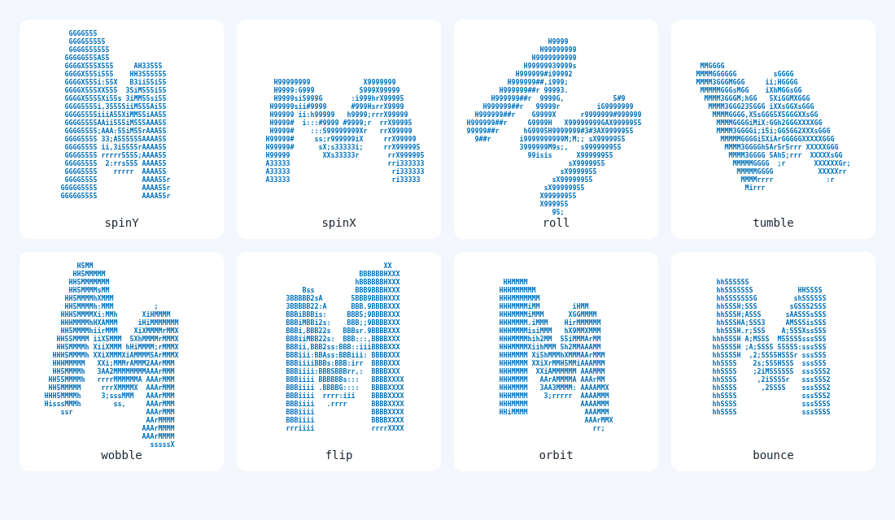
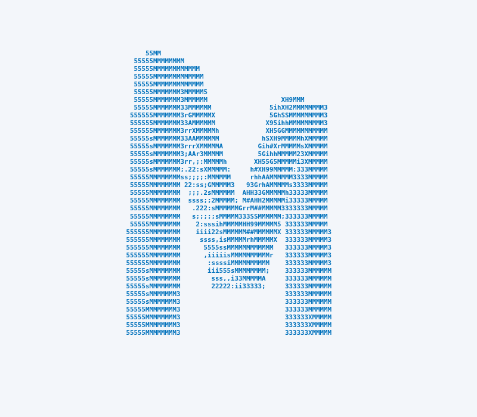

# monster-ascii

<p align="center">
  <a href="https://developer.mozilla.org/en-US/docs/Web/JavaScript" target="_blank"></a>
  <a href="https://nodejs.org/" target="_blank"></a>
  <a href="https://www.npmjs.com/" target="_blank"></a>
</p>

Apache-2.0 licensed animated ASCII art for browsers and terminals. Plain JavaScript ES modules, no build step and no runtime dependencies. Text, images and masks become selectable character grids. The 3D renderer extrudes the silhouette into a closed surface with front, back and boundary walls, eight rotation modes, Lambert lighting with a movable light and a z-buffer.

Install: `npm install github:Monstertov/monster-ascii`

[Live demo](https://monstertov.github.io/monster-ascii/docs/)


## Browser

```js
import { mount, textMask } from 'monster-ascii/web';
const animation = await mount(document.querySelector('#art'), textMask('M'), {
  width: 80, effect: 'spin3d', rotation: 'tumble', color: '#0071bc', fontSize: 'fit'
});
animation.update({ speed: 0.5, rotation: 'flip' });
animation.setMask(textMask('Hi'));
// Call when removing the component:
animation.destroy();
```

Without a bundler, import `./src/web.js` directly. Serve files over HTTP. `mount(element, source, options)` takes a mask, an image URL, or nothing, which draws the letter M. `textMask(text, { width, font, weight })` rasterizes text from a font through a canvas into a mask `width` pixels wide (default 160, weight 500, `system-ui` sans). Image URLs are sampled at 128 columns by default with `loadImage(url, size)`; cross-origin image servers must allow canvas access.

`mount` creates a crisp, selectable `pre`, draws rows twice as tall as columns so shapes keep their proportions, fits the container with ResizeObserver, pauses rendering off-screen and in hidden tabs, and shows the time-zero frame for reduced motion. Changing `speed` with `update` does not make the animation jump. The container gets an accessible label. `fontSize` is a number in pixels, `'fit'` to fill the container in both directions, or omitted to fit the container width with a 12 px cap. It returns `update(options)`, `setMask(mask)` and `destroy()`.

## Rotations

The `spin3d` effect takes a `rotation` option:

| rotation | Motion |
| --- | --- |
| spinY | Turns around the vertical axis with a slight tilt sway. The default |
| spinX | Turns end over end around the horizontal axis |
| roll | Rolls in the screen plane around Z, with a gentle sway |
| tumble | Turns around X and Y at the same time |
| wobble | Oscillates back and forth, no full turns |
| flip | Eased 180 degree turns around Y with a pause between them |
| orbit | Precession: the axis circles the view direction while the shape turns slowly |
| bounce | Hops with a squash on landing while turning around Y |

```js
createRenderer(mask, { effect: 'spin3d', rotation: 'orbit' });
```

```sh
node src/cli.js --rotation orbit
```



`pose(rotation, seconds, tilt)` returns the row-major 3x3 matrix, vertical offset `dy`, squash `sy` and size `fit` that a mode uses, and `rotations` lists the names.

## Examples

Serve the repository over HTTP with `python3 -m http.server`, then open an example. Each HTML file imports directly from `../src/`. The examples follow the system color scheme and reduced-motion preference.

- [Spinning M](https://monstertov.github.io/monster-ascii/examples/spin.html): a plain page with one spinning M.

  

- [Rotation modes](https://monstertov.github.io/monster-ascii/examples/rotations.html): all eight rotations side by side.

- [Terminal commands](https://github.com/Monstertov/monster-ascii/blob/main/examples/terminal.md): spinning, wave and plain-text output.

  

## Core

```js
import { mMask, createRenderer } from 'monster-ascii';
const mask = mMask(128); // or imageMask(width, height, rgbaPixels)
const render = createRenderer(mask, { width: 80, height: 40 });
const frame = render(1.25); // seconds
console.log(frame.text);
```

A mask has `width`, `height`, and `data` coverage/luminance values from zero to one. `mMask(size)` builds a capital M in code, so tests and the CLI need no font or image file. A frame has `width`, `height`, `chars`, `brightness` and newline-separated `text`. `render(seconds, overrides)` composes options per frame. Helpers: `createModel(mask, depth)`, `rotate(x,y,z,angle,tilt)`, `pose(rotation, seconds, tilt)`, `clamp(value,min,max)` and `colorAt(color, brightness)`.

## Options

| Option | Default | Meaning |
| --- | --- | --- |
| width | 60 | Character columns, minimum 2 |
| height | width / 2 | Rows, assumes cells twice as tall as wide. Tall masks get proportionally more rows |
| ramp | ` .,:;irsXA253hMHGS#9B&@` | Dark to bright characters, at least two. Any Unicode characters |
| effect | spin3d | One of the six effects below |
| rotation | spinY | Rotation mode of `spin3d`, see Rotations |
| speed | 1 | Time multiplier, zero freezes |
| depth | 0.24 | Extrusion depth in model coordinates |
| tilt | 0.16 | Base X tilt in radians |
| light | [-0.35, -0.45, 0.82] | Light direction as screen-space `[x, y, z]`: x right, y down, z toward the viewer |
| invert | false | Negative image: swaps shape and background and flips the shading |
| color | #0071bc | #rrggbb, array of gradient stops, or `brightness` |
| fps | 30 | Browser/terminal frame cap |
| fontSize | auto | Browser only: pixels, or `'fit'` |
| label | Animated ASCII art | Browser aria-label |

Effects: `spin3d` rotates a lit solid; `wave` undulates the image; `glitch` scrambles and resolves every four seconds; `scan` sweeps a shimmer line; `breathe` varies size and brightness; `static` holds the image. All accept width, ramp, speed, invert and renderer colors. Per-character color uses brightness to select a gradient stop or grayscale value.

## Terminal

```sh
npx monster-ascii --rotation tumble --width 60 --color '#0071bc'
npx monster-ascii --effect wave --fps 30 --speed 0.8
npx monster-ascii logo.png --rotation flip
```

Without a file the CLI draws the built-in M. A PNG or SVG file path works too. Options: `--effect`, `--rotation`, `--width`, `--height`, `--color`, `--fps`, `--speed`, `--ramp`, `--depth`, `--tilt`, `--light x,y,z`, `--invert`, `--time seconds` and `--help`.

PNG decoding uses only Node's zlib and supports noninterlaced grayscale, RGB, indexed, grayscale-alpha and RGBA PNG at valid 1/2/4/8/16-bit depths, PNG filters and transparency, with CRC validation. Interlaced input reports an error. SVG requires `rsvg-convert` from Debian's `librsvg2-bin`; absence produces a clear error. Use Node 20 or later. TTY output uses ANSI truecolor and restores the cursor and screen on SIGINT/SIGTERM. Redirected output, `NO_COLOR` or `TERM=dumb` prints one plain-text frame: the flat image, or with `--time` the chosen effect and rotation at that moment.

Node exports `loadImage(file)`, `decodePNG(buffer)`, `ansiFrame(frame,color)` and `animate(mask,options,stream)` returning a stop function.

## Validation and performance

`node --test` uses only stdlib: 50 tests cover every rotation mode (frame size, change over time, no NaN, valid rotation matrices), the M mask, a PNG round trip, the CLI options and the PNG decoder. `node scripts/benchmark.js` measures 300 warmed frames at 80 by 40 on the built-in M mask (128 by 128 pixels). On an Intel Xeon Silver 4210R with Node 20.19.2: spin3d 2.052 ms/frame, wave 0.353, glitch 0.318, scan 0.388, breathe 0.277, static 0.275 (median of five runs). The eight rotation modes of spin3d take 1.761 to 2.014 ms/frame. The 30 fps budget is 33.33 ms. Results vary by hardware and source resolution.

Browser checks use Playwright, a test-only install and not a library dependency. They start their own static server, drive the demo (every rotation, text, columns, font size, ramp, color, background, invert, fps cap, fullscreen, reduced motion), load the examples and fail on any console error. Run them with the pinned official image `mcr.microsoft.com/playwright:v1.58.2-noble`, which matches `playwright@1.58.2` ([tag list](https://mcr.microsoft.com/en-us/artifact/mar/playwright/tag/v1.58.2), [Docker source](https://github.com/microsoft/playwright/blob/main/utils/docker/Dockerfile.noble)):

```sh
docker run --rm --ipc host -v "$PWD":/work -w /work \
  mcr.microsoft.com/playwright:v1.58.2-noble \
  bash -c 'npm install --no-save --package-lock=false playwright@1.58.2 && node --test && node scripts/browser-check.mjs'
```

`node scripts/browser-check.mjs --publish` also regenerates the README images in `docs/` and `examples/screenshots/` on a fake clock, so every pose is the same on each run. Other screenshots go to `screenshots/`, which is excluded from git.

## License and credit

monster-ascii is licensed under the [Apache License 2.0](LICENSE). Copyright 2026 Monstertov. Redistributions, in source or binary form, must include the [NOTICE](NOTICE) file and keep the license text.

If you use monster-ascii, please credit it as "monster-ascii by Monstertov" with a link: [monster-ascii by Monstertov](https://github.com/Monstertov/monster-ascii).
