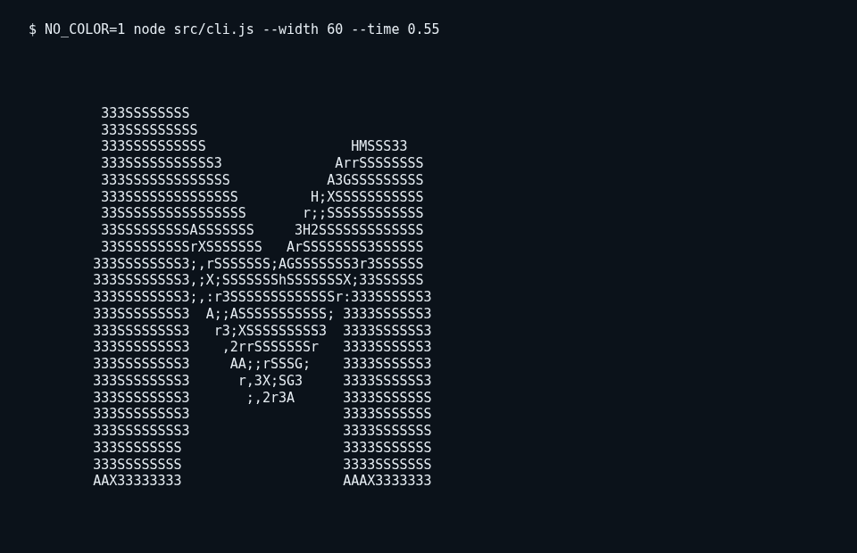

<!-- CLI examples with the built-in M. Run from the repository root. -->
# Terminal examples

Use Node 20 or later. Without a file argument the CLI draws the built-in capital M.
Image files (PNG, or SVG with `rsvg-convert` from `librsvg2-bin`) work the same way.
Run these commands from the repository root, with no build step or package install.

```sh
# A blue, spinning solid M. Stop animations with Ctrl+C.
node src/cli.js --effect spin3d --width 60 --color '#0071bc'

# Pick any rotation mode: spinY, spinX, roll, tumble, wobble, flip, orbit, bounce.
node src/cli.js --rotation tumble --speed 0.8

# A wave across the M at 30 frames per second.
node src/cli.js --effect wave --fps 30

# Move the light and use a coarser character ramp.
node src/cli.js --light 1,-0.5,0.8 --ramp ' .:-=+*#%@'

# One uncolored frame at 0.55 seconds, suitable for logs or copying.
NO_COLOR=1 node src/cli.js --width 60 --time 0.55

# Save a plain-text M. Redirected output is always one frame.
node src/cli.js --width 60 > m.txt
```

Animations require an interactive terminal. `NO_COLOR`, `TERM=dumb`, or redirected
output prints a single plain-text frame: the flat image by default, or the chosen
effect at `--time` seconds.


